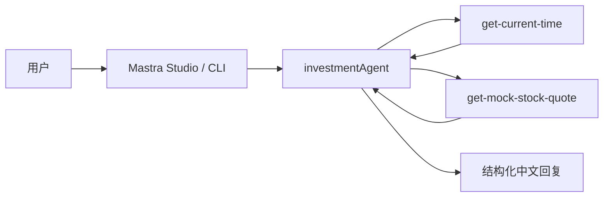

# 架构概览（Phase 0）

## 目录结构

```text
investment-agent/
├── apps/
│   └── web/                    # Next.js UI（Phase 4 实现）
├── packages/
│   └── agent-core/             # Mastra Agent 核心
│       └── src/
│           ├── mastra/         # Agent、Tool 注册入口
│           │   ├── agents/
│           │   └── tools/
│           └── cli/            # 终端流式对话
└── docs/
    ├── architecture.md
    └── disclaimer.md
```

## 数据流（Phase 0）



## 技术栈

| 层级 | 选型 |
|------|------|
| Agent 框架 | Mastra |
| 语言 | TypeScript |
| 存储 | LibSQL（本地 mastra.db） |
| LLM | DeepSeek（`DEEPSEEK_API_KEY`，Mastra 原生支持） |

## 演进路线

- **Phase 0**（当前）：Hello Agent + 2 个演示 Tool
- **Phase 1**：Tool 基建、Memory、RAG、Eval
- **Phase 2**：东方财富/腾讯真实 A 股数据
- **Phase 3**：五步 Research Workflow
- **Phase 4**：Next.js 投研 UI
