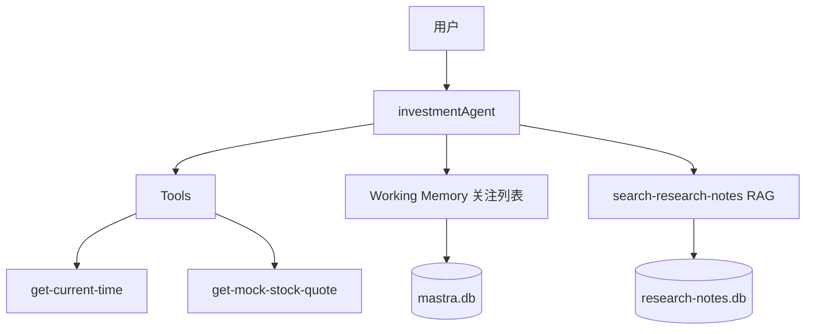

# Phase 1 学习笔记：Agent 工程核心

Phase 1 在 Phase 0 的「Agent → Tool → 回复」链路上，补了 4 块工程能力。

## 本阶段新增能力



## 1. Tool 基建（`src/lib/`）

| 模块 | 作用 | 何时用 |
|------|------|--------|
| `safeFetch` | 域名白名单 + 超时 + HTTP 状态检查 | Phase 2 接 Tushare/外部 API |
| `retryWithBackoff` | 指数退避重试 | 网络抖动、429/503 |
| `zodValidate` | 运行时数据校验 | Tool 入参/出参、API 响应 |

**学习要点**：Tool 不仅要「能跑」，还要「可控」——限域名、限时、可重试、可校验。

## 2. Working Memory（关注列表）

文件：[`src/mastra/memory.ts`](../packages/agent-core/src/mastra/memory.ts)

- 用 Zod schema 定义 `watchlist`（最多 5 只）和 `riskPreference`
- Agent 自动获得 `updateWorkingMemory` Tool
- `scope: 'resource'` 表示同一用户跨对话保留

**试试这些对话**：
- `把贵州茅台 600519 加入关注，备注：白酒龙头`
- `我关注了哪些股票？`
- `我的风险偏好是保守`

## 3. 迷你 RAG（投研笔记库）

| 文件 | 作用 |
|------|------|
| `src/data/notes/*.md` | 3 篇示例投研笔记 |
| `src/scripts/ingest-notes.ts` | 分块 → embedding → 写入向量库 |
| `src/mastra/tools/research-notes-tool.ts` | 语义检索 Tool |

**Embedding**：使用 `@mastra/fastembed` 本地模型，无需额外 API Key。

**运行入库**：
```bash
pnpm ingest
```

**试试这些对话**：
- `根据笔记库，贵州茅台有哪些风险？`
- `银行板块应该关注什么指标？`

**学习要点**：RAG = 检索（向量相似度）+ 生成（LLM 综合）。回答应引用 `file`/`source` 字段。

## 4. Eval（Agent 版单元测试）

| 文件 | 作用 |
|------|------|
| `src/eval/cases.ts` | 10 条黄金测试用例 |
| `src/eval/run.ts` | 批量运行 + 关键词命中检查 |

```bash
pnpm eval              # 跑全部 10 条
pnpm eval time-beijing # 跑单条
```

**学习要点**：Eval 不是测 LLM 文采，而是测**关键事实是否出现**（代码、时区、风险提示等）。

## 验收清单

- [ ] `pnpm ingest` 成功入库
- [ ] 问笔记相关问题，回答带引用来源
- [ ] 说「加入关注」后，再问「我关注了哪些」能记住
- [ ] `pnpm eval` 大部分 case 通过（LLM 有随机性，不必 100%）

## 下一步：Phase 2

接入 Tushare 真实 A 股数据，把 `get-mock-stock-quote` 替换为真实行情/财报 Tool。
