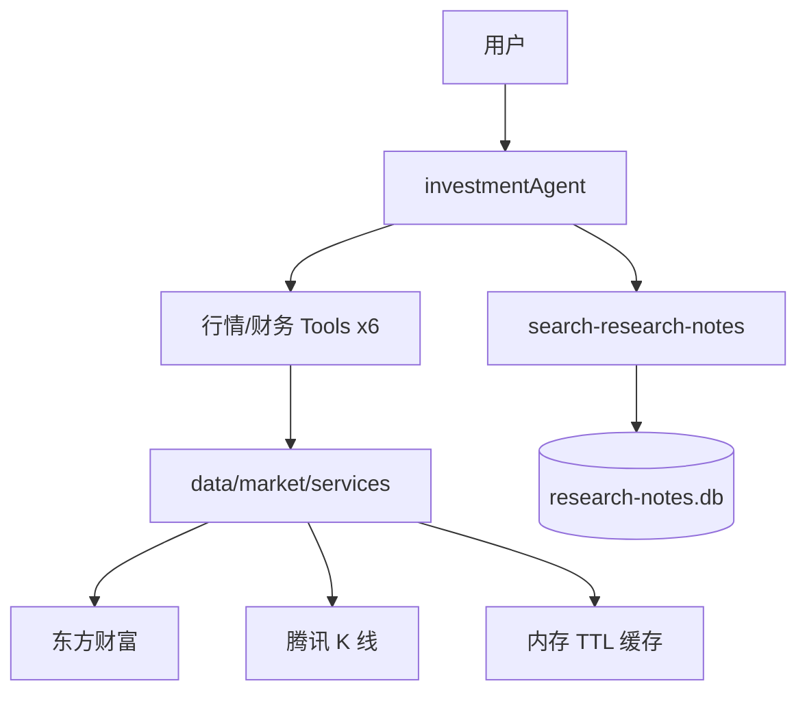

# Phase 2 学习笔记：A 股真实数据（东方财富 + 腾讯）

Phase 2 把 Phase 0 的模拟行情，升级为 **真实 A 股数据** + **结构化研报输出**，全部使用免费公开接口。

## 本阶段新增能力



## 1. 数据层（`src/data/market/`）

| 文件/目录 | 作用 |
|-----------|------|
| `services.ts` | 6 个投研能力的统一入口 |
| `symbols.ts` | `toTsCode()` 6 位代码 → `600519.SH` |
| `cache.ts` | 内存 TTL 缓存 |
| `free/eastmoney.ts` | 基本信息、财务、公告、新闻、同业 |
| `free/tencent.ts` | 日线 K 线 |

**学习要点**：
- 免费接口非官方授权，仅供学习；请控制请求频率
- `cached: true` 表示命中内存缓存，须在研报中标注
- `dataSource` 为 `eastmoney` 或 `tencent`

## 2. 六个投研 Tool（`src/mastra/tools/market/`）

| Tool ID | 数据源 | 能力 |
|---------|--------|------|
| `get-stock-basic` | 东方财富 | 代码/名称、行业、上市日期 |
| `get-daily-quote` | 腾讯 | 近期日线行情 |
| `get-financial-report` | 东方财富 F10 | 营收、净利润、ROE、负债率 |
| `get-announcements` | 东方财富 | 近期公告标题 |
| `compare-peers` | 东方财富行业板块 | 同业 PE/PB 对比 |
| `search-news` | 东方财富 | 相关新闻标题 |

## 3. 结构化研报 Prompt

当用户说「分析 XXX」时，Agent 按固定流程调用多个 Tool，输出 Markdown 研报（公司概况 → 行情 → 财务 → 同业 → 公告 → 资讯 → 笔记库 → 数据来源 → 风险）。

## 4. 试试这些对话

- `分析贵州茅台 600519`
- `查询宁德时代 300750 最近行情和财务指标`
- `平安银行 000001 同行业对比怎么样？`

## 5. Eval

```bash
pnpm eval
pnpm eval market-research-report
```

## 验收清单

- [ ] `分析贵州茅台 600519` 输出完整结构化研报
- [ ] 研报「数据来源」体现 `eastmoney` 或 `tencent`
- [ ] `pnpm eval market-research-report` 通过

## 下一步：Phase 3

多 Agent 协作或工作流编排。
