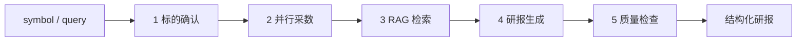

# Phase 3 学习笔记：五步 Research Workflow

Phase 3 把 Phase 2「单 Agent + Prompt 指挥调 Tool」升级为 **Mastra Workflow 编排**——步骤由代码定义，行为可重复、可验收。

## 本阶段新增能力



## 1. Workflow vs 单 Agent

| 单 Agent（Phase 2） | Workflow（Phase 3） |
|---------------------|---------------------|
| LLM 决定调哪些 Tool | 代码规定步骤顺序 |
| 可能漏步骤、乱序 | 每步必执行 |
| 难以端到端测试 | 可用 CLI / Eval 验收 |
| 一个 Agent 包办 | 可拆撰写 Agent |

**学习要点**：Prompt 管「怎么说」，Workflow 管「做什么、按什么顺序做」。

## 2. 五步流程（`research-workflow.ts`）

| 步骤 ID | 做什么 | 实现 |
|---------|--------|------|
| `identify-target` | 解析代码、查基本信息 | `getStockBasic` |
| `pick-symbol` | 提取 6 位代码 | 纯转换 |
| `fetch-market-data` | **并行**采行情/财务/公告/新闻/同业 | `Promise.allSettled` |
| `search-notes` | 笔记库 RAG | `searchResearchNotes` |
| `prepare-prompt` | 组装撰写 Prompt | 纯字符串 |
| `write-report` | 调用 `reportWriterAgent` | `agent.generate` |
| `quality-check` | 检查必备章节 | 规则引擎 |

### 并行采数 + 容错

`fetch-market-data` 用 `Promise.allSettled`：某个接口失败不会拖垮整条链路，错误写入 `fetchErrors`，研报「待人工核实」会提示。

### 双 Agent 分工

- `investmentAgent`：自由对话、关注列表、RAG 问答
- `reportWriterAgent`：只根据结构化数据写研报，**不挂 Tool**

## 3. 关键文件

| 文件 | 作用 |
|------|------|
| `src/mastra/workflows/research-workflow.ts` | Workflow 定义 |
| `src/mastra/agents/report-writer-agent.ts` | 研报撰写 Agent |
| `src/mastra/workflows/research/quality.ts` | 质量规则 + 代码解析 |
| `src/data/rag/search-notes.ts` | Workflow 内直接 RAG（不经 Tool） |
| `src/cli/research.ts` | CLI 入口 |

## 4. 命令

```bash
pnpm research 600519
pnpm research 分析平安银行 000001

pnpm eval:workflow
pnpm eval:workflow workflow-maotai
```

## 5. 在 Studio 中使用

```bash
pnpm dev
```

打开 Mastra Studio，选择 `researchWorkflow` 运行，输入：

```json
{ "symbol": "600519" }
```

## 验收清单

- [ ] `pnpm research 600519` 输出完整研报
- [ ] 研报含「数据来源与时效」「风险提示」「不构成」
- [ ] Workflow Summary 显示 `质量检查: PASS`
- [ ] `pnpm eval:workflow workflow-maotai` 通过

## 与 Phase 2 的关系

- Phase 2 的 `services.ts` / market Tool **被 Workflow 复用**
- `investmentAgent` 保留，适合探索性对话
- `pnpm research` 适合「我要一份标准研报」的确定性场景

## 下一步：Phase 4

Next.js 投研 UI：输入股票代码 → 触发 Workflow → 渲染 Markdown 研报。
