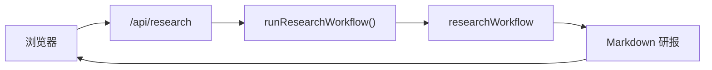

# Phase 4 学习笔记：Next.js 投研 UI

Phase 4 把 Phase 3 的 `researchWorkflow` 接到 **Web 界面**，形成完整产品闭环。

## 本阶段新增能力



## 1. 架构：Monorepo 前后端一体

| 包 | 职责 |
|----|------|
| `@investment-agent/agent-core` | Mastra、Workflow、数据层 |
| `@investment-agent/web` | Next.js UI + API Route |

Web 通过 **API Route 子进程** 调用 agent-core（避免 Next 打包 Mastra 原生依赖）：

```typescript
// apps/web/app/api/research/route.ts
pnpm exec tsx src/cli/research-json.ts 600519
→ JSON 研报 → 返回浏览器
```

对外 API 封装仍在 agent-core：

```typescript
// packages/agent-core/src/api/run-research-workflow.ts
export async function runResearchWorkflow(input) { ... }
```

## 2. 关键文件

| 文件 | 作用 |
|------|------|
| `packages/agent-core/src/api/run-research-workflow.ts` | 对外暴露 Workflow 运行 API |
| `apps/web/app/api/research/route.ts` | 子进程调用 `research-json.ts` |
| `packages/agent-core/src/cli/research-json.ts` | CLI JSON 输出（供 Web 调用） |
| `apps/web/app/page.tsx` | 输入代码 + Markdown 渲染 |

## 3. 环境变量

Web 复用 `packages/agent-core/.env`，由子进程里的 `tsx` + `dotenv` 自动加载。

## 4. 命令

```bash
# 终端 1：可选，Mastra Studio 调试
pnpm dev

# 终端 2：Web UI
pnpm web:dev
# → http://localhost:3000
```

## 5. 与 Phase 3 的关系

| 入口 | 适用场景 |
|------|----------|
| `pnpm research 600519` | CLI / 脚本 |
| Studio → Workflows | 调试步骤 |
| **Web UI** | 产品化体验、给非技术用户 |

三条路跑的是 **同一个** `researchWorkflow`。

## 6. 前端要点（你的强项）

- `'use client'` 页面：表单状态、loading、错误处理
- `react-markdown` 渲染研报
- API Route 用 `child_process` 调 agent-core，而非直接 import Mastra
- `react-markdown` 渲染研报

## 验收清单

- [ ] `pnpm web:dev` 启动成功
- [ ] 输入 `600519` 点击生成，约 30s 内出研报
- [ ] 页面显示质检 PASS/FAIL 与耗时
- [ ] 研报 Markdown 正常渲染（标题、表格）

## 下一步扩展（可选）

- 流式输出（Workflow stream → SSE）
- 历史研报列表（存 LibSQL / 文件）
- 聊天页 + Workflow 触发（Agent 挂 workflows）
