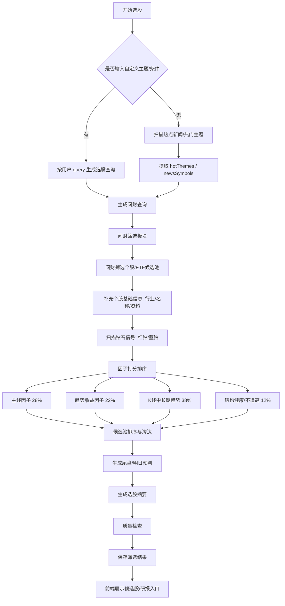
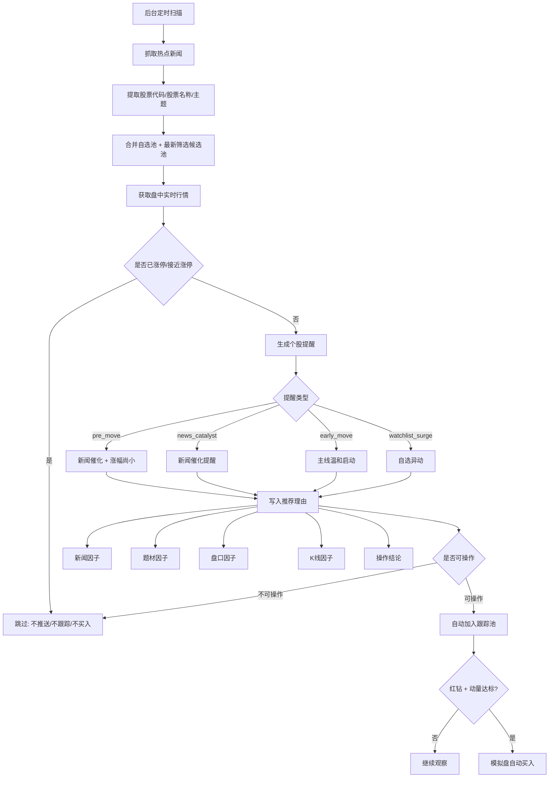

# 选股流程图

本文记录当前系统里的选股与盘中消息雷达主流程，方便后续对照代码和页面行为。

## 主选股流程

```mermaid
flowchart TD
  A[开始选股] --> B{是否输入自定义主题/条件}
  B -->|有| C[按用户 query 生成选股查询]
  B -->|无| D[扫描热点新闻/热门主题]
  D --> E[提取 hotThemes / newsSymbols]
  C --> F[生成问财查询]
  E --> F

  F --> G[问财筛选板块]
  G --> H[问财筛选个股/ETF候选池]
  H --> I[补充个股基础信息: 行业/名称/资料]
  I --> J[扫描钻石信号: 红钻/蓝钻]
  J --> K[因子打分排序]

  K --> K1[主线因子 28%]
  K --> K2[趋势收益因子 22%]
  K --> K3[K线中长期趋势 38%]
  K --> K4[结构健康/不追高 12%]

  K1 --> L[候选池排序与淘汰]
  K2 --> L
  K3 --> L
  K4 --> L

  L --> M[生成尾盘/明日预判]
  M --> N[生成选股摘要]
  N --> O[质量检查]
  O --> P[保存筛选结果]
  P --> Q[前端展示候选股/研报入口]
```

## 盘中消息雷达流程

```mermaid
flowchart TD
  A[后台定时扫描] --> B[抓取热点新闻]
  B --> C[提取股票代码/股票名称/主题]
  C --> D[合并自选池 + 最新筛选候选池]
  D --> E[获取盘中实时行情]
  E --> F{是否已涨停/接近涨停}
  F -->|是| G[跳过: 不推送/不跟踪/不买入]
  F -->|否| H[生成个股提醒]

  H --> I{提醒类型}
  I -->|pre_move| J[新闻催化 + 涨幅尚小]
  I -->|news_catalyst| K[新闻催化提醒]
  I -->|early_move| L[主线温和启动]
  I -->|watchlist_surge| M[自选异动]

  J --> N[写入推荐理由]
  K --> N
  L --> N
  M --> N

  N --> N1[新闻因子]
  N --> N2[题材因子]
  N --> N3[盘口因子]
  N --> N4[K线因子]
  N --> N5[操作结论]

  N --> O{是否可操作}
  O -->|不可操作| G
  O -->|可操作| P[自动加入跟踪池]
  P --> Q{红钻 + 动量达标?}
  Q -->|否| R[继续观察]
  Q -->|是| S[模拟盘自动买入]
```

主流程负责找候选池、排序和给理由；消息雷达负责盘中发现催化、过滤不可买标的，并自动进入跟踪或模拟盘验证。
